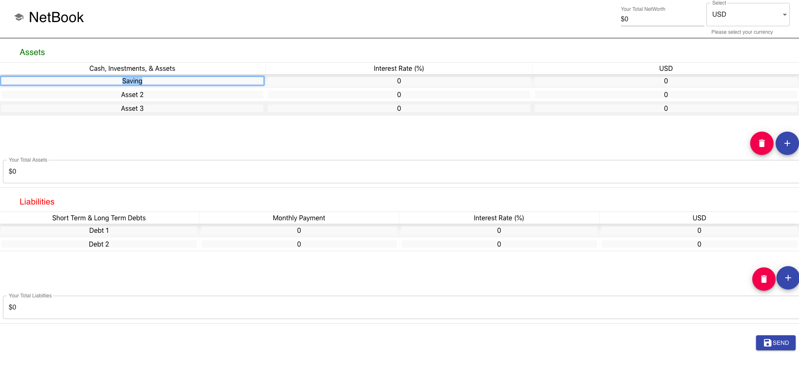

# NetBook

> A simple web based net worth calculator for people to determine their assets, liabilities, and net worth.



## Technologies
- [React](https://github.com/facebook/create-react-app#readme)
- [Golang](https://golang.org/)

## Getting Started
Clone this repository
```
$ git clone git@github.com:cxchan1/netbook.git
```
Install node modules, [Yarn](https://yarnpkg.com/en/) is highly recommended.
```
$ cd netbook/netbook-client/ && yarn install
```
Run netbook front end:
```
$ yarn start
```
Run netbook server side, [Golang](https://golang.org/doc/install):
```
$ cd netbook/netbook-server/ && go run main.go
```
## Bugs
- Make sure you start the front end first before you run the server side. Otherwise, front-end and back-end won't talk to each other because of Node.js (localhost only)
- (WARNING) Currently, there is no database on the server side yet so right now there is no way to save your data on the application.
